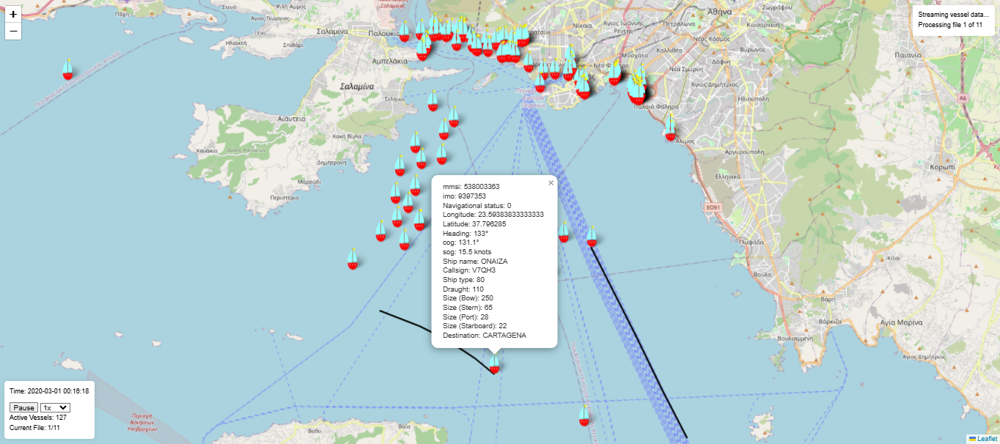

# Vessel Tracking Map Application

This application provides real-time vessel tracking using Leaflet for map visualization and Socket.IO for real-time data streaming.

## Features

- **Real-Time Vessel Updates:** Displays real-time vessel positions on a map.
- **Custom Vessel Markers:** Uses custom icons to represent vessels.
- **Control Panel:** WIP
- **Streaming Status:** Displays the current streaming status and file processing progress.
- **Interactive Map:** Shows detailed information about each vessel in a popup.

---

## Table of Contents
- [Setup](#Setting-everything-up)
- [Getting Started](#getting-started)
- [File Structure](#file-structure)
- [Map Features](#map-features)
- [Socket.IO Events](#socketio-events)
- [Development Notes](#development-notes)

---
## Setup
### Prerequisites

- Node.js, npm and docker installed on your system.

```
git clone <repoURL>
cd streamData/myApp/streamData
npm install
npm run build
```
Create a Docker Network
```
docker network create mynetwork
```
Start PostgresSQL container
```
docker run --network=mynetwork --name postgres-db -e POSTGRES_USER=myuser -e POSTGRES_PASSWORD=mypassword -e POSTGRES_DB=mydatabase -p 5433:5432 -d postgres
```
Create the Vessel table by uncomment the line 15 - 21 and then:
```
node testDB.js
```

Find test for the db setup in testDB.js (lines 1-10)
```
node testDB.js
```

## Getting Started
Ensure postgres is running 
```
docker ps
```
Start if req
```
docker start postgres-db
```
```
npm start
```

### Preview


